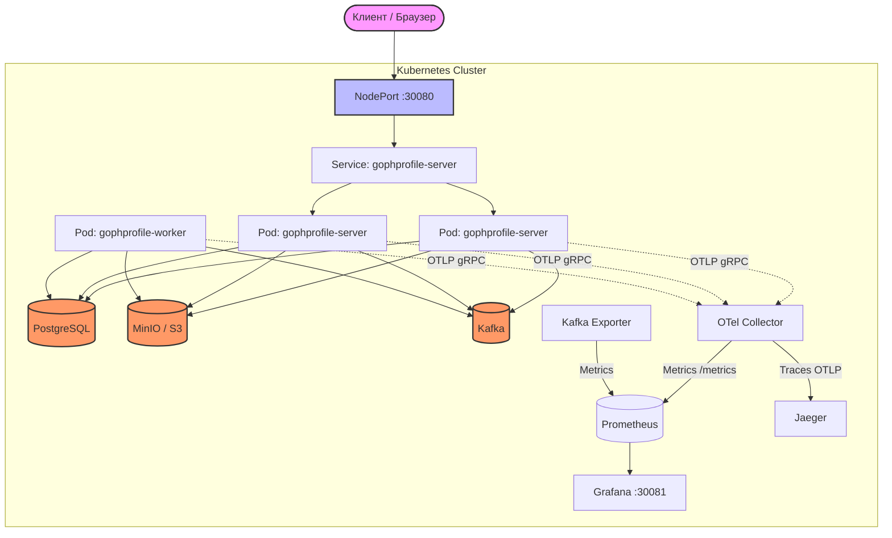

# Архитектура GophProfile в Kubernetes

Ниже представлена схема взаимодействия компонентов системы при развертывании в локальном Kubernetes-кластере (Rancher Desktop / minikube) с использованием Helm.

### Описание компонентов:
1. **Client:** Запросы поступают на NodePort (порт 30080).
2. **Server (API):** Обрабатывает HTTP-запросы, загружает оригиналы в S3, сохраняет метаданные в PostgreSQL и отправляет задачи в Kafka. Масштабируется с помощью HPA.
3. **Worker:** Асинхронно читает сообщения из Kafka, скачивает оригинал, делает миниатюры, грузит их обратно в S3 и обновляет статусы в БД.
4. **PostgreSQL:** Хранит метаданные аватарок.
5. **MinIO:** S3-совместимое хранилище бинарных файлов (оригиналов и миниатюр).
6. **Kafka:** Брокер сообщений для асинхронной обработки.
7. **OTel Collector:** Собирает трейсы и метрики (бизнес-метрики и метрики БД) с Server и Worker.
8. **Prometheus:** Скрапит метрики с OTel Collector (порт 8889) и Kafka Exporter. Настроен через `ServiceMonitor` (Prometheus Operator).
9. **Grafana:** Визуализирует метрики из Prometheus. Дашборды (Business KPIs, Kafka Monitoring) загружаются автоматически из ConfigMap.
